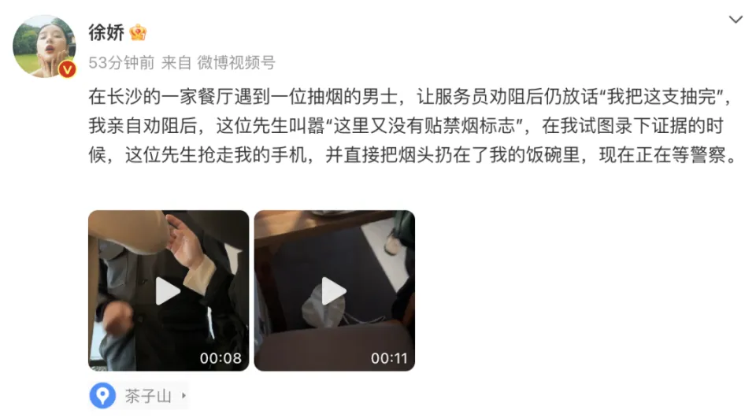
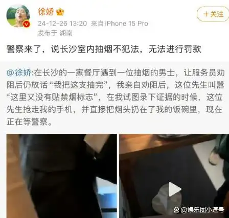
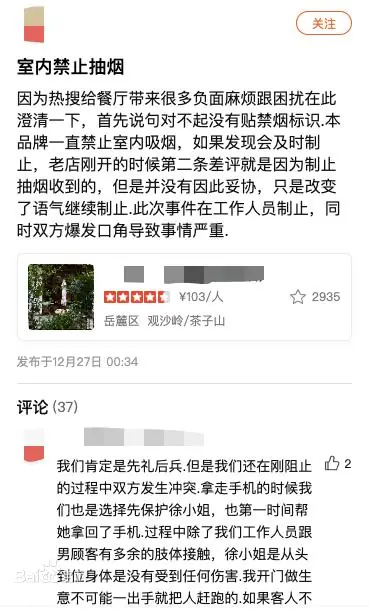

# 不同城市，不同命运

[254 个城市已出台法规，但控烟立法仍「道阻且长」](https://www.jiemian.com/article/11241159.html) 介绍：

> 2024 年 5 月 31 日是第 37 个世界无烟日，这也是中国全面推进控烟的第 19 年。
>
> 当前，我国控烟立法主要以地区性立法为主。**2023 年，44 个城市新出台或修订了市级控烟相关法规。截至目前，我国 24 个省份出台省级控烟相关法规，254 个城市出台市级控烟相关法规，无烟环境建设成果持续巩固**。
>
> 2006 年《公约》生效以来，银川、杭州、哈尔滨、天津、长春、南宁等城市就开始尝试出台控烟法规。到 2014 年之前，立法城市以二线及以下城市为主，控烟条款相对宽松，全部明文允许设置吸烟室（区）。
>
> 2014 年 11 月 28 日《北京市控制吸烟条例》出台，全国地方性控烟立法进入了严格激进阶段，这一时期开展控烟立法的城市有北京、福州、广州、上海、兰州、上饶、乌海、杭州、西安、深圳、武汉、郑州、青岛等城市。立法城市以一线城市、新一线城市为主。控烟要求严苛激进，其中 5 个城市不允许设置吸烟室，2 个城市允许设置但有一定的过渡期。
>
> 然而 2020 年以后，控烟立法重回审慎阶段。以 2020 年通过的《重庆市公共场所控制吸烟条例》为例，其中规定，公共场所的室内区域禁止吸烟。但是，餐饮服务场所、住宿休息服务场所、公众娱乐场所的室内区域，可以划定或者设置吸烟区。而银川、西安也暂缓了对《银川市公共场所控制吸烟条例》《西安市控制吸烟条例》修订的进程。
>
> 事实上，允许设置吸烟区可能会引起执法困境。济南市卫健委 2021 年给人大代表的一份答复中谈到，**给室内设置吸烟室「开绿灯」不仅违反国内外法规，有悖于健康至上的社会共识，还违背了科学立法、有效执法的原则**。答复还称，**重庆、大连设置室内吸烟室，脱离工作实际，不具备可操作性，至今无法出台吸烟室的设置标准、场所责任、执法主体和违法吸烟行为取证等相关管理及执法细则，法规执行几近停滞**。
>
> 姜垣表示，控烟立法的力度涉及到各利益主体之间的博弈。烟草行业是控烟履约的主要责任方之一，但是对于开展公共场所严格的控烟立法持保留态度。部分省市的烟草经济占宏观经济的比例较高，对地方经济有较大支撑作用，这些地区一般不倾向于出台全面控烟法规。
>
> 例如产烟大省云南的控烟阻力就非常明显。「云南的烟草太强了，」姜垣此前接受媒体采访时介绍，在云南开展控烟相关的培训、宣传等活动，均会受到当地烟草业的影响，**一些活动甚至要事先知会烟草业**。
>
> 上海市健康促进委员会办公室副主任王彤表示，数据显示，自 2017 年上海实行室内全面禁烟后，全市年均控烟执法处罚金额达 220 万元以上，至 2023 年底累计近 1600 万元。而成效也相当明显，上海法定禁烟场所违规吸烟发生率从控烟立法前的 37.5%下降至 12.3%。自控烟立法以来，上海市成人吸烟率已下降了 7.5 个百分点至 19.4%，提前达到「健康中国 2030」目标。

## 开历史倒车

[新华网评禁烟：平装香烟推不下去国内部分烟草企业难辞其咎](https://www.thepaper.cn/newsDetail_forward_1476840) 中提到：

> 而政府在这场战役之中，无疑要担起「先锋」角色，为禁烟的「最先一公里」提供充足动力。从 2011 年 5 月的《公共场所卫生管理条例实施细则》到 2016 年国务院立法工作计划中的《公共场所控制吸烟条例》，我国的禁烟工作虽然取得了一定成效，但是全国性的无烟环境法律仍处于空缺状态，使得相关工作的执行环节难有依据，处罚也落不到实处。此外，《公共场所控制吸烟条例》历经 19 个月的意见征集期，却在最后阶段失守，将「在公共场所、工作场所室内全面禁烟」修改为「在部分公共场所可设置吸烟区域」，如餐厅、酒吧、咖啡厅、棋牌室等，给特殊情况开的口子越来越多，公共场所实现全面禁烟就增加了不少难度。因此，要想避免规定成为「空头支票」，政府部门要敢于攻坚克难，咬住「最先一公里」，为禁烟工作注入一剂强心针。

[世卫组织:平装成全球趋势 呼吁出台全国无烟立法](https://jiankang.cctv.com/2016/05/30/ARTICRnsMIHcLCA5bbCNuaUU160530.shtml) 介绍：

> 《北京市控制吸烟条例》是中国迄今为止最严格的控烟立法，完全符合世卫组织《烟草控制框架公约》（世卫组织《公约》）第八条的要求——该条款要求所有室内工作场所、公共交通工具、室内公共场所以及适当的其他公共场所必须全面禁烟。二手烟暴露没有安全水平可言。因此，该条款不允许任何例外。中国已于 2005 年批准了世卫组织《公约》，并于 2006 年正式生效。
>
> 「北京的经验表明全面禁烟是可以实现的——我们有相当可靠的『概念证明』。现在是时候出台一部严格的全国无烟立法，将北京市民正在享受的无烟环境扩展到全国其他地区了，」施贺德博士称。
>
> 「但很遗憾，目前出现的《公共场所控制吸烟条例（草案征求意见稿）》存在许多严重的漏洞——如单人办公室允许吸烟。例外对待领导的单人办公室，将形成一种特权文化，使其他人面临健康风险。」施贺德博士解释道。
>
> 该草案征求意见稿不仅对单人办公室例外，还规定许多服务场所允许吸烟，其中包括餐厅、酒吧和酒店。
>
> 「出台有漏洞的全国无烟立法完全不符合中国作为世卫组织《公约》的缔约方所应履行的国际法律责任，也无法保护中国人民免受二手烟伤害，对个人和经济都会是巨大的损失。我们呼吁立法者抵制企图削弱国家无烟立法的行径。值此世界无烟日到来之际，我们尤其应该给全国人民一个交代，保护他们的健康是我们的责任。」施贺德博士称。

这些糟糕的例外情况无疑是对控烟一盘棋的极大破坏，对待禁烟，必须零容忍。

有人在开倒车，也有人在负重前行。

## 夸夸组

### 上海

[「他还报警！」上海老伯公交站抽烟，拳打劝阻者被刑拘](https://www.peopleapp.com/column/30036719228-500001764878) 报道：

> 据宝山公安分局介绍，**2019 年 8 月 19 日** 19 点 50 分许，小伙王先生在共富新村地铁站附近的宝山三路公交车终点站等车，他闻到一股烟味飘来，发现一名老伯正在排队候车的人群中吸烟。
>
> 当时车站候车的人不少，王先生上前劝阻这位老伯不要吸烟，但对方并没有停止，一根接一根抽起来。
>
> 「我就用**上海话**跟他说，你要么把烟掐掉，你要么去外面抽，这里那么多人，为了大家健康，你最起码这点要做到的对吧？」小王回忆说。
>
> 抽烟的老伯则称：「你管不到我，打 110 过来，我也继续抽。」于是，王先生拨打了 110 报警，等待民警到来。
>
> 忽然，抽烟的老伯挥拳打向王先生，将王先生推倒在地，导致眼部有裂伤。在此过程中，王先生没有还手。
>
> 事发后，民警很快赶到现场，将两人带往派出所接受调查。
>
> 接受讯问时，抽烟的老伯表示：「他就说我二手烟三手烟，啰嗦得不得了，而且他还报警！为了抽一根烟他要报警。」
>
> 民警告诉他，根据法律法规，公共场所必须禁烟。这名老伯认为，公交车站属于室外，可以抽烟，因此王先生不该阻止他。
>
> 根据《上海市公共场所控制吸烟条例》规定，室外公共场所禁止吸烟的范围，包括人群集聚的公共交通工具等候区域。个人在禁止吸烟场所吸烟且不听劝阻的，由相关监督部门责令改正，并处以 50 元以上 200 元以下罚款。
>
> 宝山警方表示，上述打人的老伯已被警方依法刑事拘留。

还挺逗的，烟瘾上来了好像吸毒一样六亲不认，也不管劝阻的人是「城里人」还是「乡窝宁（乡下人）」了，先打了再说。

B 站 UP 主 [肖恩看](https://space.bilibili.com/32426113) 于 **2024 年 5 月 1 日**「因劝阻他人不要在有老人、孕妇、小孩的餐厅内吸烟而遭到了围殴」，「此前，餐厅众人多次劝阻无效，对方反而更加嚣张」，最终结果大快人心，请看视频：

- [离谱！我被当成外地人，在上海被打了！【有后续】](https://www.bilibili.com/video/BV1fZ421T7on/)
- [我被打后，究竟能拿到多少赔偿？【真实后续+金额】](https://www.bilibili.com/video/BV1uH4y1c7MY/)
- [年度爽文！被打后手把手教你拿到人生第一桶金！【被打后续 逐帧分析】](https://www.bilibili.com/video/BV152421Z7FF/)

通过比较激烈的后果预告，而不是辱骂、嘲讽，肖恩看同志成功吸引敌方在店内甚至店外追打他，造成了极其恶劣的社会影响，最终付出了较大的代价（因敌方年龄较大，这是处罚的不利因素）。上海有关部门的处置令全网网友出了一口恶气，成为反烟草的一个重要事件。

### 北京

[2015 年中国烟草销售量第一次下降，我们以为拐点来了，没想到空喜一场｜姜垣](https://mp.weixin.qq.com/s?__biz=MzI0MzA3OTI1MA==&mid=2651615882&idx=1&sn=7bf6e17a96b692f587a5514fd80d826f&chksm=f28a53b7c5fddaa139c0466ea0500afc6967dcfbad1171e69302bf920f96eae2514ee3cb9829&mpshare=1&) 介绍：

> 北京这五年将近有 5 万例投诉举报。而且，北京控烟有张图，将科技和控烟相结合，但非常遗憾，知道的人很少。其实大家手里头都有手机，都有一个 APP 叫微信。你打开微信钱包，里头有一个「城市管理」，点进去有一个「控烟投诉」，你在碰到室内吸烟问题的时候，就可以通过这种方式投诉，可以选择实名和匿名，甚至可以上传照片。投诉以后，这个场所就亮起了一盏蓝灯，如果被投诉了五次，就会亮起一盏红灯，而且前二十位被投诉的单位，每两个月媒体会曝光一次，卫生监督所要约谈。
>
> 控烟五周年的时候，我们查看投诉数据，发现排名第一的是一位马先生，是清华大学的一名海归教授。后来我们就去找他，问他为什么能四年投诉 68 次。马先生说这是特别好的一件事情，能够促进北京公共场所变成无烟。所以北京的控烟，不只是北京市人大、北京市政府、北京市疾控中心和北京市 1400 名卫生监督者的事情，而是北京 2200 万人都应该做的一件事。
>
> 北京和上海有一个热线号码 12320，有五名专职人士帮助大家戒烟，而且成功率很高。

## 喷喷组

### 长沙

[小宇宙-药不能停：32. 控烟协会：1 月 20 日起餐厅就不禁烟了吗？我们还能做什么？](https://www.xiaoyuzhoufm.com/episode/678e4cd1c3617f02a40f01fb?s=eyJ1IjogIjYzYTAzNDg1ZWRjZTY3MTA0YTc3ZTE2NiJ9) 再提徐娇在长沙餐厅劝阻吸烟的事件，这起事件的前因后果如何？

[「徐娇劝阻抽烟」餐厅致歉：双方爆发口角，她没有受到伤害](https://news.qq.com/rain/a/20241227A05I9Z00)：

> 12 月 26 日，演员徐娇在个人社交账号发文：「在长沙的一家餐厅遇到一位抽烟的男士，让服务员劝阻后仍放话『我把这支抽完』，我亲自劝阻后，这位先生叫嚣『这里又没有贴禁烟标志』，在我试图录下证据的时候，这位先生抢走我的手机，并**直接把烟头扔在了我的饭碗里**，现在正在等警察。」
>
> 
>
> 几分钟后，徐娇转发此条博文并补充：「警察来了，说长沙室内抽烟不犯法，无法进行罚款」
>
> 
>
> 徐娇还继续在评论区表示：「这位先生的意思是如果我删除拍摄的内容，他就向我道歉，警察也对此提议表示肯定，但是我不删，也不需要/接受他的道歉。」
>
> 
>
> 目前，徐娇的该条博文已不可见。

2024 年 12 月 27 日，涉事餐厅回应称：

> 因为热搜给餐厅带来很多负面麻烦跟困扰在此澄清一下，首先说句对不起没有贴禁烟标识，本品牌一直禁止室内吸烟，如果发现会及时制止，老店刚开的时候第二条差评就是因为制止抽烟收到的，但是并没有因此妥协，只是改变了语气继续制止。此次事件在工作人员制止，同时双方爆发口角导致事情严重。
>
> 我们肯定是先礼后兵，但是我们还在阻止的过程中双方发生冲突。拿走手机的时候我们也是选择先保护徐小姐，也第一时间帮她拿回了手机。过程中除了我们工作人员跟男顾客有多余的肢体接触，徐小姐是从头到尾身体是没有受到任何伤害。我开门做生意不可能一出手就把人赶跑的。如果客人不听劝我们会再采取其他措施。
>
> 涉事餐厅名为 [chen·亚洲融合菜（滨江店）](http://dpurl.cn/B1ekVkzz)，至今仍能在问答区、评论区找到战斗的痕迹。
>
> 

《[长沙市文明行为促进条例](https://www.csrd.gov.cn/web/article/d67e50caad28419db55320d7f70a3012)》规定：

> 第十八条 禁止下列影响公共安全和秩序、损害公共利益和他人权益的其他不文明行为：
>
> （十一）在公共交通工具、禁止吸烟的室内公共场所吸烟。
>
> 第二十九条 文化、旅游、银行、邮政、通信、医疗卫生、公共交通等窗口服务行业应当制定职业道德规范和优质服务标准，树立窗口文明形象；制定、公示本行业文明行为规范，设立优待、禁烟、噪音控制等文明宣传告示牌，引导健康、文明消费；保障现役军人、残疾军人、消防救援人员等特殊人群依法享有公共服务优先权。
>
> 公共场所的经营者、管理者对不文明行为应当予以劝阻；公共交通工具和禁止吸烟的室内公共场所的经营者、管理者应当对吸烟行为予以劝阻。
>
> 第三十七条 违反本条例第十八条第十一项规定，在公共交通工具、禁止吸烟的室内公共场所吸烟的，由市人民政府确定的行政执法部门责令改正，处五十元罚款；情节严重的，处二百元罚款。
>
> 违反本条例第二十九条第二款规定，公共交通工具和禁止吸烟的室内公共场所的经营者、管理者对吸烟行为未予以劝阻的，由市人民政府确定的行政执法部门处二千元罚款。

警察来了，说长沙室内抽烟不犯法，无法进行罚款？无法进行罚款？无法进行罚款？打人大的脸？

### 杭州

[2015 年中国烟草销售量第一次下降，我们以为拐点来了，没想到空喜一场｜姜垣](https://mp.weixin.qq.com/s?__biz=MzI0MzA3OTI1MA==&mid=2651615882&idx=1&sn=7bf6e17a96b692f587a5514fd80d826f&chksm=f28a53b7c5fddaa139c0466ea0500afc6967dcfbad1171e69302bf920f96eae2514ee3cb9829&mpshare=1&) 中说：「现在支持吸烟的社会风气依然存在。比如，大红鹰烟草集团赞助西湖的玫瑰婚典集体婚礼，已经连续好几年了。」

### 扬州

[2015 年中国烟草销售量第一次下降，我们以为拐点来了，没想到空喜一场｜姜垣](https://mp.weixin.qq.com/s?__biz=MzI0MzA3OTI1MA==&mid=2651615882&idx=1&sn=7bf6e17a96b692f587a5514fd80d826f&chksm=f28a53b7c5fddaa139c0466ea0500afc6967dcfbad1171e69302bf920f96eae2514ee3cb9829&mpshare=1&) 中，主讲人讲了一个故事：

> 俗话说「烟花三月下扬州」，今年我先生的侄女在美丽的扬州大学结婚。结果没想到，人群密集的婚礼现场有好多人在吸烟，哪怕还有孩子和孕妇在场。我就赶紧找到婚礼的主持人，非常漂亮的一个小帅哥，让他在婚礼开始的时候告诉大家室内不能吸烟，但是主持人不理我。
>
> 我年龄比较大，坐的是挺重要的一桌，但还是有人吸烟，甚至桌上就摆着烟。我就说，各位能不能不吸烟，我们这里有孩子。没有人理我，坚持在吸烟。所以我就很郁闷，只能自己走出去，**在 3 月的扬州，美丽的扬州大学，走了一个半小时，没吃饭**。
