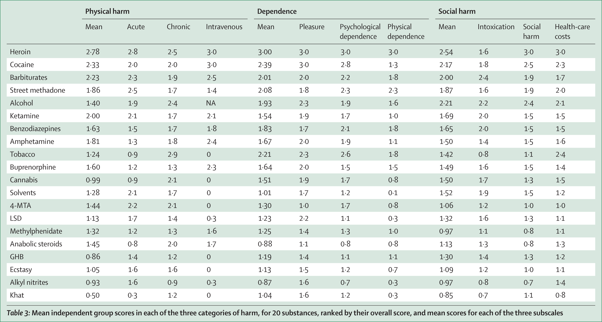

# 售烟贩毒，抽烟吸毒

首先，我们来看看我国所认定的毒品有哪些。[我国管制毒品目录（截止到 2024 年 7 月，509 种+两大类）](https://dcppc.swupl.edu.cn/jddt/bbaa1bb6f945437ca097836a65f79fb4.htm) 指出：

> 我国刑法、禁毒法规定，毒品是指鸦片、海洛因、甲基苯丙胺（冰毒）、吗啡、大麻、可卡因，以及国家规定管制的其他能够使人形成瘾癖的麻醉药品和精神药品。

无论自然科学还是社会科学，非常离不开的一样东西就是逻辑，人类因逻辑而发展出了灿烂的文化，合理的逻辑推导能带领我们揭示事物的本质。**如果一种物质，其各方面的危害性不逊于引文所明确定义的毒品，那么不管它在当下的法律层面叫不叫毒品，它事实上就是毒品**。

下面，我们来尝试比较一下烟草和大麻。

## 基本介绍

### 药物依赖

韦恩・韦登（Wayne Weiten）所著的《心理学导论》介绍：

> 人们能变得身体或心理上依赖药物，身体依赖是麻醉剂、镇静剂、酒精和刺激性药物产生的常见问题。**身体依赖**（physical dependence）指某人必须持续摄入药物从而避免戒断反应。戒断反应的症状根据特定药物而不同。戒断海洛因、巴比妥类药物和酒精会产生发热、寒冷、震颤、惊厥、呕吐、痉挛、腹泻和严重疼痛。戒断兴奋剂会导致更加轻微的症状，例如疲倦、冷淡、易怒、迷失。戒断也会引起负面情绪倾泻和强烈的用药欲望，通常导致人们重新开始用药（Baker et al.，2006）。
>
> **心理依赖**（psychological dependence）指一个人持续用药从而平息对药物强烈的心理和情绪渴求。心理依赖比身体依赖更轻微，但是它产生的需求是强大的。例如可卡因会产生难以抵抗的持续用药的需要。心理依赖可能存在于所有消遣药物中，但很少出现在致幻剂中。
>
> 两种类型的依赖都是通过重复用药而逐步建立的。最初只有身体依赖被认为存在生理基础。但是理论家认为两种类型的依赖均反映突触传递的变化（Di Chara，1999；Self，1997）。边缘多巴胺通路的失调似乎是产生沉溺的主要原因（Nestler & Malenka，2004），但是其他穿过杏仁核和额叶神经回路的长期变化也可能导致药物渴求（Kalivas & Volkow，2005）。

### 大麻

韦恩・韦登（Wayne Weiten）所著的《心理学导论》介绍：

> **大麻类药物**（cannabis）是大麻、hashish、THC 的来源——大麻类植物。大麻是来自这种植物的干叶子、花茎、种子的混合物。Hashish 来自植物的汁液。THC 是大麻中活跃的化学成分，能够用作研究目的而被合成（例如，用于不能很好抽大麻的动物身上）。当被抽烟抽入时大麻能立即产生持续几小时的影响。预期的感受是，<u>轻微的、放松的愉悦感和提高感觉觉知。副作用可能包括心率、焦虑的上升，减缓的心理功能和受损的记忆</u>。

#### 大麻的有害性

苑佳玉等所撰写的论文《[大麻的成瘾性和潜在的药用价值](https://kns.cnki.net/kcms2/article/abstract?v=i_LPdPvRpB74icyGIloTQMPNVG6qC2XHHmTvNXo_XBieXdAdFhsf5-alFmJOqPWvhCdtv2TiZtIBI6RbSN_LGsl2Mo9WM-qumsSNDQb6xw1MkfRlp5FZ777VUfBPtt3ftaIM2rbw6tVeEA13FFIwRuuLxNpmW62NDxwBm-68aVE=&uniplatform=NZKPT)》中陈述：

> 据报道，大麻使用者精神病的发生率增加了 14％，有大麻吸食历史的精神病患者住院时间延长，次数增多。吸食大麻者中成瘾的比例约为 9％。由于大麻作为软性毒品是其他毒品的敲门砖，大麻成瘾者使用其他毒品的比例大幅上升。

John A Henry、William L G Oldfield、Onn Min Kon 所撰写的 [Comparing cannabis with tobacco](https://pmc.ncbi.nlm.nih.gov/articles/PMC1125867/) 指出：

> We already know that regular use of cannabis is associated with an increased incidence of mental illnesses, most notably schizophrenia and depression, but it is also worth examining its potential to cause other illnesses, especially those of the heart and respiratory system.
>
> 我们已经知道，长期使用大麻与精神疾病发病率的增加有关，其中最显著的是精神分裂症和抑郁症，但同样值得研究的是它是否会导致其他疾病，尤其是心脏和呼吸系统的疾病。
>
> Tetrahydrocannabinol has cardiovascular effects, and sudden deaths have been attributed to smoking cannabis. Myocardial infarction is 4.2 times more likely to occur within an hour of smoking cannabis.
>
> 四氢大麻酚（THC）具有心血管效应，且已将吸食大麻与突发死亡联系在一起。吸食大麻后一小时内发生心肌梗死的可能性是平时的 4.2 倍。

### 烟草（尼古丁）

郝伟等所撰写的论文《[尼古丁依赖与烟瘾戒除](https://kns.cnki.net/kcms2/article/abstract?v=i_LPdPvRpB5lxfe9bdodn4s5rGwJjWBqvQ13SUdEt4j--hiejLOdXVofw4F0gfq1KSAJuViGsYyh46VesPlsS0jIn25kHyv2_AAY3UxLOCZEkX5Eda51alZPW7g8sPoKfGYKrZOCnfF_1_YWtKd4p9qrGw1Jam5x&uniplatform=NZKPT)》中陈述：

> 吸食烟草是世界上可以预防的致死、致残、致引发疾病的重要因素之一，至 2020 年它将成为所有发达国家和发展中国家要面对的头号健康公敌。尼古丁是导致机体对烟草产生依赖的重要首要活性物质，作用于中枢神经系统，引起多巴胺等神经递质的释放。像其他产生化学物质的依赖一样，尼古丁被认为是激活中脑边缘多巴胺系统产生犒赏作用。

[烟瘾大揭秘——尼古丁如何掌控我们的大脑与欲望](http://www.weihaicdc.cn/art/2024/10/14/art_64891_5128325.html) 介绍：

> 在烟草制品中，每克干燥烟草含有 2%-4%生物碱，而总生物碱 90%为尼古丁。烟草制品中尼古丁的含量各异，例如：一根卷烟大约含有 13-29 毫克尼古丁，每毫升电子烟烟油含有 6-36 毫克尼古丁，而每克咀嚼烟草则含有约 10 毫克尼古丁。
>
> 尼古丁入侵尼古丁在体内的吸收速度和效率取决于摄入方式。吸烟时，人们通常在 5-7 分钟内吸 8-12 口，每口吸入大约 40 至 75 毫升的烟雾，总共吸入约 0.5-0.6 升。平均每支卷烟含有 1-3 毫克尼古丁，其中大约 25%会迅速进入血液，并在短短 15 秒内抵达大脑。相比之下，嚼烟时，以 30 分钟内嚼 8 克烟草为例，平均摄入的尼古丁量为 4.5 毫克。然而，如果尼古丁是通过吞服摄入，它将在肝脏中经历首过效应，这会显著降低尼古丁的生物利用度，意味着实际进入血液循环的尼古丁量会减少。
>
> 尼古丁成瘾是一个涉及大脑生物化学变化的复杂过程。首先，尼古丁进入大脑后迅速与烟碱型乙酰胆碱受体（nAChRs）结合，触发多巴胺、去甲肾上腺素、血清素、谷氨酸和 γ-氨基丁酸（GABA）等关键神经递质的释放。这些递质的释放对于尼古丁产生的奖赏效应和成瘾过程至关重要。特别是，尼古丁增强了来自腹侧被盖区（VTA）的多巴胺神经元向核伏隔区（NAc）发送信号的过程，这一过程直接关联于快感和奖赏感受的产生。这种增强的多巴胺活动使吸烟者感受到满足和愉悦，增加了他们再次寻求尼古丁的行为。随着尼古丁使用的持续，大脑对尼古丁的敏感性降低，导致耐受性的产生。这意味着为了获得与之前相同的奖赏效果，需要更大的尼古丁剂量。尼古丁的半衰期大约为 2 ～ 3 小时，当血液中的尼古丁浓度下降时，吸烟者可能会遭遇焦虑、烦躁和吸烟的强烈渴望等戒断症状。为了避免这些不适，吸烟者可能会频繁吸烟，以维持血液中尼古丁的浓度，这进一步加剧了对尼古丁的依赖。

#### 烟草的有害性

陕师大李锐的硕士论文《[尼古丁成瘾行为的心理机制研究](https://kns.cnki.net/kcms2/article/abstract?v=i_LPdPvRpB6Q5v01ERKN_QK0su1N_taaYMqO9KXnGplf3ymuXoiz-qyirGH7MWaaSHykpz2KgnH1J2DRvOArAQPJ1fwAY0THIGK4B6NpUkpJFCZO6qy0hwWh5qHe51ZelsKMFSbphQfF6evTVJpKGFGBtE4KWKBCJcdNOfngHg4=&uniplatform=NZKPT)》介绍道：

> 首先，从烟草烟雾中的有害物质说起，烟草燃烧后释放的烟雾中包含 4000 多种化学物质，主要包括以下几类：尼古丁、烟焦油、刺激性化合物、有害金属以及一氧化碳。被大众所熟知的应该当属**尼古丁**了，它是烟草中的重要成分，又叫烟碱，让吸烟者明知吸烟危害却无法放弃的主要原因是因为尼古丁的成瘾作用，长期吸食尼古丁可以让吸烟者从生理和心理上产生依赖，如果短时间内吸食过量可以让人感觉到头晕、目眩，出现恶心、呕吐等症状，严重可致人死亡。**烟焦油**是烟草烟雾中最有毒性的成分，它含有多种直接引发癌症和间接促发癌症的物质。目前提倡的安全型卷烟指的是降低了烟焦油含量的香烟，但是研究发现，降低烟焦油含量并不意味着降低了烟焦油的危害。同样，成千上万的研究和临床病例也证实，各类刺激性化合物、有害金属和一氧化碳是引发呼吸系统、心脑血管系统、生殖系统和内分泌系统疾病的危险因素。
>
> 其次，烟草的危害不止于吸烟者本身，吸烟所产生的**二手烟**对吸烟者周围人群具有更大的危害，二手烟包括吸烟者吐出来的主流烟雾和香烟自燃产生的侧流烟，其中，侧流烟所包含的有毒物质较之主流烟更多，危害性也更大[^1]。由于吸烟人群的众多及广泛分布，所以我国遭受二手烟危害的人群亦非常之多，研究统计目前中国有 7.4 亿的非吸烟者遭受二手烟的暴露危害[^2]。然而，二手烟的危害还在于对儿童和女性的危害上，二手烟对女性的危害不仅体现在众多的疾病以及患癌风险上，还会影响女性的孕育，如遭受二手烟危害的女性宫外孕的几率会大大提高。对儿童的危害一方面是在孕育过程中，对小孩的胚胎发育的严重影响。另外一方面，由于婴幼儿的免疫力功能低下，如果长期暴露于吸烟环境当中，则极易患上肺炎、支气管炎和哮喘等呼吸系统疾病[^3]。
>
> 目前，全世界吸烟的人数已超过 11 亿，吸烟引发的死亡也越来越多，据统计，2011 年全世界死于吸烟相关疾病的人数多达 500 万，而中国每天就有近 3000 人死于吸烟相关疾病，这些数字触目惊心，然而，如果烟草的使用得不到合理的控制，这些可怕的数字还会大幅度增长[^4]。

[^1]: 罗良德, 邓发基, 徐成银.《公约》框架下控烟支持环境的构建与探讨[J]. 中国卫生资源, 2010, 13(02): 53-55.
[^2]: 李云霞, 姜垣, 杨焱, 等. 中国公共场所禁止吸烟法规现状分析[J]. 环境与健康杂志, 2007, (04): 221-223.
[^3]: 李新华. 《烟草控制框架公约》与 MPOWER 控烟综合战略[J]. 中国健康教育, 2008, (09): 649-656.
[^4]: 邵宏, 牛天华, 徐希平. 尼古丁成瘾的研究概况[J]. 中国药物依赖性杂志, 2000, (01): 9-11.

再具体一点呢？《中国吸烟危害健康报告 2020》编写组编写的[《中国吸烟危害健康报告 2020》概要](https://qikan.cqvip.com/Qikan/Article/Detail?id=7105889747) 中指出：

> 吸烟是慢阻肺发生的主要危险因素。有研究显示，至少 25% 的持续吸烟者发展成为慢阻肺患者。Liu 等在 100 万中国人中开展的一项前瞻性队列研究发现，在因吸烟导致的死亡中，45% 归因于慢阻肺。
>
> Huang 等对 2012-2015 年「中国成人肺部健康研究」数据进行分析后发现，吸烟者患哮喘的风险是不吸烟者的 1.89 倍。
>
> Xiao 等基于「中国成人肺部健康研究」数据分析发现，吸烟者发生小气道功能异常的风险是不吸烟者的 1.16 倍。
>
> Lin 等在中国台湾地区进行了一项纳入 17699 例 ≥ 12 周岁受试者的前瞻性队列研究，3.3 年随访结果显示，吸烟者患活动性肺结核的风险是不吸烟者的 1.94 倍。
>
> 关宏宇等对湖北某国有大型铁矿 1960-1974 年在册且工作 ≥1 年的 3 647 名接尘工人开展调查，发现吸烟者的尘肺发病风险是不吸烟者的 1.7 倍。
>
> Liu 等对中国城乡地区 100 万人的死因调查结果显示，男性吸烟者死于肺癌的风险是不吸烟者的 2.72 倍。
>
> 戴奇等于 1984-1990 年先后进行了基于全人群的肺癌、卵巢癌、肾癌、膀胱癌、喉癌、口腔癌、胃癌及结肠癌的病例对照研究，结果显示，女性吸烟者发生口腔癌的风险是不吸烟女性的 2.2 倍。Chen 等在中国福建开展的一项病例对照研究结果显示，男性吸烟者患口腔癌的风险随吸烟量的增加而增加，吸烟指数<20 包/年、20-40 包/年、≥ 40 包/年的男性吸烟者患口腔癌的风险分别是不吸烟者的 1.47 倍、1.62 倍和 2.84 倍。
>
> 耿敬等对 1980-2014 年发表的 9 项关于中国人群喉癌发病率影响因素的病例对照研究（共纳入 1 373 例喉癌病例和 1 598 例对照受试者）进行 Meta 分析，结果显示，吸烟者患喉癌的风险是不吸烟者的 6.35 倍。
>
> 韩瑞发等对 23 项关于中国人群膀胱癌发病危险因素的研究进行 Meta 分析，发现吸烟是膀胱癌发病的高危因素之一，吸烟者患膀胱癌的风险是不吸烟者的 1.38 倍。
>
> 龚杰等对 29 项病例对照研究和 7 项队列研究进行 Meta 分析后发现，吸烟是肝癌发生的危险因素之一，且吸烟量越大、吸烟年限越长，肝癌的发病风险越高；吸烟指数 <20 包/年和 ≥20 包/年者患肝癌的风险分别是不吸烟者的 1.27 倍和 1.57 倍。
>
> Li 等对 10 项前瞻性研究（包括 338 多万例研究对象）进行 Meta 分析后发现，男性现在吸烟者患胃癌的风险是不吸烟者的 1.63 倍，女性现在吸烟者患胃癌的风险是不吸烟者的 1.30 倍；男性现在吸烟者患胃癌的风险比女性现在吸烟者高 30%。
>
> ……（罄竹难书）

综合来看，烟草给人带来了大约翻倍的健康风险。

## 烟草与大麻的成瘾性比较

目前找到的最早依据是 Anthony, James C.、Warner, Lynn A.、Kessler, Ronald C. 所撰写的 [Comparative epidemiology of dependence on tobacco, alcohol, controlled substances, and inhalants: Basic findings from the National Comorbidity Survey.](http://secure.hawaiianethos.com/assets/resources/1994-Anthony-Comp-Epidemiology-Addiction.pdf) 一文。比较重要的是下面这张图，在第 13 页：

表内的结论被 Jonathan P. Caulkins、Peter Reuter、Martin Y. Iguchi、James Chiesa 概括在 [How Goes the 「War on Drugs」? An Assessment of U.S. Drug Problems and Policy](https://www.rand.org/content/dam/rand/pubs/occasional_papers/2005/RAND_OP121.pdf) 一文：

> It has been estimated that 23 percent of those who try heroin, 17 percent of those who try cocaine, and 9 percent of those who try marijuana become clinically dependent on the drug (the rates for tobacco and alcohol are 32 percent and 15 percent, respectively).

纽约时报的 [What Science Says About Marijuana](https://www.nytimes.com/2014/07/31/opinion/what-science-says-about-marijuana.html) 一文沿用了上述数据：

> The Institute of Medicine, the health arm of the National Academy of Sciences, said in a 1999 study that 32 percent of tobacco users become dependent, as do 23 percent of heroin users, 17 percent of cocaine users, and 15 percent of alcohol drinkers. But only 9 percent of marijuana users develop a dependence.

该文也有中文版，但标题有些变化——[大麻的危险性低于酒精与烟草？](https://cn.nytimes.com/opinion/20140822/c22marijuana/)：

> 药学研究中心是国家科学院的健康分部，它在 1999 年的一份研究报告中说，32% 的吸烟者会上瘾，23% 的海洛因使用者会上瘾，17% 的可卡因使用者会上瘾，15% 的饮酒者会上瘾，但只有 9% 的大麻使用者会上瘾。

David Nutt 等人所撰写的 [Development of a rational scale to assess the harm of drugs of potential misuse](<https://www.thelancet.com/journals/lancet/article/PIIS0140-6736(07)60464-4/abstract/>) 中的表 3 汇总了数据：

简单翻译一下可以得到这个表：

|                 成瘾性物质 | 成瘾性平均值 |
| -------------------------: | ------------ |
|                     海洛因 | 3.00         |
|                     可卡因 | 2.39         |
|                   **烟草** | **2.21**     |
|                 街头美沙酮 | 2.08         |
|                   巴比妥类 | 2.01         |
|                   **酒精** | **1.93**     |
|                 苯二氮卓类 | 1.83         |
|             苯丙胺（冰毒） | 1.67         |
|                   丁丙诺啡 | 1.64         |
|             氯胺酮（K 粉） | 1.54         |
|                   **大麻** | **1.51**     |
|         4-甲基硫基安非他命 | 1.30         |
|                     哌甲酯 | 1.25         |
|         LSD 致幻剂（邮票） | 1.23         |
|       γ-羟基丁酸（听话水） | 1.19         |
|                     摇头丸 | 1.13         |
|             巧茶（恰特草） | 1.04         |
| 挥发性有机溶剂（强力胶等） | 1.01         |
|             合成代谢类固醇 | 0.88         |
|                   亚硝酸酯 | 0.87         |

其中的部分毒品介绍可以参看 [国家禁毒办权威发布毒品基础知识（一）：传统毒品](http://www.nncc626.com/2018-06/26/c_129901396.htm)、[国家禁毒办权威发布毒品基础知识（二）：合成毒品](http://nncc626.com/2018-07/05/c_129907520.htm)、[国家禁毒办权威发布毒品基础知识（三）：新精神活性物质](http://www.nncc626.com/2018-07/05/c_129907533.htm)。

在部分国家的相关利益集团看来，**大麻成瘾性低于烟草**是大麻合法化的有力依据，但在本协会看来，这也是烟草非法化的可靠证据之一。

## 烟草与大麻的有害性比较

Dirk W. Lachenmeier 和 Jürgen Rehm 所撰写的 [Comparative risk assessment of alcohol, tobacco, cannabis and other illicit drugs using the margin of exposure approach](https://www.nature.com/articles/srep08126) 采用一种叫暴露边界值（MOE）的方法来评估毒物的风险，MOE 越低，风险越高。研究指出，烟草的风险被低估，属于高风险类别，而大麻的风险可能被高估，属于低风险类别。

Robert Melamede 所撰写的 [Cannabis and tobacco smoke are not equally carcinogenic](https://link.springer.com/article/10.1186/1477-7517-2-21) 回顾现有的科学数据，比较了大麻和烟草烟雾的致癌性质及其生物学后果。文章强调，尽管大麻和烟草烟雾在化学成分上相似，但它们的药理学特性差异显著。**大麻烟雾通过多种机制减少了致癌途径，而烟草烟雾则增强了致癌途径**。此外，大麻中的 THC 通过抑制致癌物的激活和调节免疫反应，减少了自由基的产生，从而降低了致癌风险。这些发现为大麻的医疗使用提供了科学依据，并强调了烟草和大麻在健康影响上的差异。不过，该研究也有局限性，它主要基于现有的科学文献和实验数据，缺乏直接的临床试验支持。

Sally E. Rooke、Melissa M. Norberg、Jan Copeland、Wendy Swift 所撰写的 [Health outcomes associated with long-term regular cannabis and tobacco smoking](https://www.sciencedirect.com/science/article/abs/pii/S0306460313000257) 旨在通过调查澳大利亚 40 岁及以上的成年人，探讨长期单独使用大麻、单独使用烟草以及同时使用这两种物质的健康影响。研究结果表明，**与单独使用大麻相比，同时使用烟草和大麻或单独使用烟草与更多的健康问题相关，尤其是在呼吸系统症状和慢性阻塞性肺病（COPD）的患病率上**。仅大麻组报告的健康状况优于其他两组，这可能与大麻的镇痛和胃肠保护作用有关。研究还发现，同时使用烟草和大麻的个体可能使用更多的大麻，这可能与尼古丁依赖有关。

John A Henry、William L G Oldfield、Onn Min Kon 所撰写的 [Comparing cannabis with tobacco](https://pmc.ncbi.nlm.nih.gov/articles/PMC1125867/) 主要探讨了大麻吸烟与烟草吸烟对健康的潜在危害，并呼吁重视大麻吸烟带来的公共健康问题。文章指出，尽管大麻吸烟的危害性不如烟草吸烟那么明确，但现有证据显示其可能对心脏和呼吸系统造成类似的影响，且这些影响可能在更年轻的人群中显现。

[大千世界丨成瘾物质大排名，第一竟然就在我们身边](https://mp.weixin.qq.com/s/8ADKOcaH_GWtdMLi_7HKWw) 中介绍，专家们根据多标准决策分析（MCDA）框架对每种成瘾物质进行评分，分析内容涵盖到成瘾物质的内在危害、社会危害，以及医疗保健成本。评分结果显示：烟草的 MCDA 危害评分高于大麻。该推文所涉文献：

> [Drug harms in the UK: a multicriteria decision analysis](https://bigfatgenius.com/2220%20Fall%202010/Nutt%20King%20Phillips%20-%20Drug%20Harms%20in%20the%20UK.pdf)
>
> [The New Zealand drug harms ranking study: A multi-criteria decision analysis](https://pmc.ncbi.nlm.nih.gov/articles/PMC10481626/)

David Nutt 等人所撰写的 [Development of a rational scale to assess the harm of drugs of potential misuse](<https://www.thelancet.com/journals/lancet/article/PIIS0140-6736(07)60464-4/abstract/>) 中的表 3 也指出烟草对身体的损害多于大麻：

|                 成瘾性物质 | 身体伤害平均值 | 社会危害平均值 |
| -------------------------: | -------------- | -------------- |
|                     海洛因 | 2.78           | 2.54           |
|                     可卡因 | 2.33           | 2.17           |
|                   巴比妥类 | 2.23           | 2.00           |
|             氯胺酮（K 粉） | 2.00           | 1.69           |
|                 街头美沙酮 | 1.86           | 1.87           |
|             苯丙胺（冰毒） | 1.81           | 1.50           |
|                 苯二氮卓类 | 1.63           | 1.65           |
|                   丁丙诺啡 | 1.60           | 1.49           |
|             合成代谢类固醇 | 1.45           | 1.13           |
|         4-甲基硫基安非他命 | 1.44           | 1.06           |
|                   **酒精** | **1.40**       | **2.21**       |
|                     哌甲酯 | 1.32           | 0.97           |
| 挥发性有机溶剂（强力胶等） | 1.28           | 1.52           |
|                   **烟草** | **1.24**       | **1.42**       |
|         LSD 致幻剂（邮票） | 1.13           | 1.32           |
|                     摇头丸 | 1.05           | 1.09           |
|                   **大麻** | **0.99**       | **1.5**        |
|                   亚硝酸酯 | 0.93           | 0.97           |
|       γ-羟基丁酸（听话水） | 0.86           | 1.30           |
|             巧茶（恰特草） | 0.50           | 0.85           |

上述文献已经论证了烟草不弱于大麻的伤害能力，更遑论在中国社会，大麻几乎无从获取，而卷烟随处可买，这显著放大了烟草的实际破坏力。

**综上所述，我们完成了「售烟即贩毒，抽烟即吸毒」的论证。**

## 令未成年人吸二手烟，该当何罪？

《[中华人民共和国未成年人保护法](https://www.moj.gov.cn/pub/sfbgw/jgsz/jgszzsdw/zsdwflyzzx/flyzzxzcxx/zcxxzcfg/zcfgfl/202010/t20201023_188560.html)》规定：

> **第五十九条**　学校、幼儿园周边不得设置烟、酒、彩票销售网点。禁止向未成年人销售烟、酒、彩票或者兑付彩票奖金。烟、酒和彩票经营者应当在显著位置设置不向未成年人销售烟、酒或者彩票的标志；对难以判明是否是未成年人的，应当要求其出示身份证件。
>
> **任何人不得在学校、幼儿园和其他未成年人集中活动的公共场所吸烟、饮酒**。
>
> **第一百二十三条**　相关经营者违反本法第五十八条、第五十九条第一款、第六十条规定的，由文化和旅游、市场监督管理、烟草专卖、公安等部门按照职责分工责令限期改正，给予警告，没收违法所得，可以并处五万元以下罚款；拒不改正或者情节严重的，责令停业整顿或者吊销营业执照、吊销相关许可证，可以并处五万元以上五十万元以下罚款。
>
> **第一百二十四条**　违反本法第五十九条第二款规定，在学校、幼儿园和其他未成年人集中活动的公共场所吸烟、饮酒的，由卫生健康、教育、市场监督管理等部门按照职责分工责令改正，给予警告，**可以并处五百元以下罚款**；场所管理者未及时制止的，由卫生健康、教育、市场监督管理等部门按照职责分工给予警告，并处一万元以下罚款。

法律规定得非常明确，小朋友的学校、儿童医院、儿童乐园一类场所，严格禁烟，吸烟就该被罚款。然而，在本协会看来，这种行为本质上是「强迫未成年人吸毒」，其应受的处罚，在当前的法律规定下过轻了。

## 中国最大的贩毒团伙——国家烟草专卖局/中国烟草总公司

### 历史上利益集团的故事

请见视频：[【医学奇迹】我是医生，我为香烟代言 | 关于西医的「黑历史」，也是一个《罪案百科》】](https://www.bilibili.com/video/BV1Ct421P7Y9)。

### 该部门是中国控烟的最大阻力

《[中国无法承受的代价：烟草流行给中国造成的健康、经济和社会损失](https://iris.who.int/handle/10665/255473)》介绍：

> 中国烟草总公司（CNTC）是世界上最大的烟草公司，也是中国政府盈利最高的国有企业之一，推动着中国烟草制品市场的发展和中国的烟草流行。中国烟草总公司在全球烟草市场所占份额比菲利普・莫里斯国际公司、英美烟草公司和帝国烟草公司等多个世界大型跨国烟草公司的总量还要大。2013 年，中国烟草总公司生产了约 25000 亿支卷烟，而紧随其后的竞争者菲利普・莫里斯国际公司的产量为 8800 万支。中国的烟草产量自 1980 年以来翻了三番。中国的烟草种植面积比其他几个较大烟草生产国（包括巴西、印度、印度尼西亚、马拉维和坦桑尼亚联合共和国）的总数还要多。中国烟草总公司控制着 98% 的中国国内烟草市场；在从烟草制品的种植、生产到最终销售的烟草生产链的每个环节，中国政府都能获得丰厚的利润。2015 年，烟草企业为中央政府贡献了 11000 亿元的收入，占政府总收入的 7% 左右。无论在中国还是其他地区，烟草企业常常借口对经济做出了贡献来反对实施更严厉的烟草控制政策。然而，烟草对经济的贡献源自一种每年直接造成 100 多万中国人死亡的产品，而这些死亡本是可以完全避免的。**这不仅仅是经济问题，而是一个更深刻的问题，即，一个政府从一种靠致命产品获得收入的产业直接获利是否恰当和道德**。这种情况与健康中国的目标背道而驰。

[【深度】烟盒上的拉锯战：中国烟草制品平装还很遥远](https://www.jiemian.com/article/673598.html) 介绍：

> 多名控烟及公共卫生专家向界面新闻指出，中国控烟最大的阻力来自于政企不分的烟草管理体制。
>
> 我国实行烟草国家专卖制度，烟草总公司受国家烟草专卖局管辖，而国家烟草专卖局是负责实施《烟草专卖法》及相关法规的专门机构，两者实际上是两块牌子、一套人马，既是烟草生产部门又是烟草管理部门。
>
> 我国于 2007 年建立公约协调机制，由 8 部委组成，其中包括管辖烟草工业的工信部。政府一方面充当着控烟者的角色，另一方面又承担扩大烟草行业生产的职责。
>
> 垄断烟草销售、管理的国家烟草专卖局也是其中主要的控烟角色之一。杨功焕指出，控烟之初，国家烟草专卖局就以政府部门身份，进入政府代表团，随后成为部际控烟协调领导小组成员。由于该部门的介入，控烟被弱化，一个典型的表现是，在《公约》条款的翻译上，第 13 条中的 Comprehensive 被翻译为「广泛」而非「全面」。
>
> 大量科学研究证明，低焦卷烟并不能降低吸烟的危害，因此《公约》禁止使用「淡味、低危害卷烟」误导和欺骗吸烟者，但中国烟草业一度将「低焦油低危害」作为促销手段，国家烟草专卖局还把降低卷烟焦油含量、推广「低害」卷烟称为履约行动。

### 「烟草院士」，可笑可笑

[【深度】烟盒上的拉锯战：中国烟草制品平装还很遥远](https://www.jiemian.com/article/673598.html) 介绍：

> 2011-2013 年期间，国内控烟界与烟草业在「减害降焦」议题上反复拉锯，并在「烟草院士」事件中引爆舆论。
>
> 「烟草院士」事件源于郑州烟草研究院副院长谢剑平以中草药「减害降焦」思路研发卷烟，被企业奉为营销热点。谢剑平还于 2011 年入选中国工程院环境与轻纺工程学部院士，引发国内控烟界的强烈反对。
>
> 2012 年，由国家烟草专卖局推荐的《中式卷烟特征理论体系构建及应用》入选了科学技术进步奖名单，钟南山、秦伯益等 30 位院士联名抵制。钟南山在接受媒体采访时表示，看不出来中式卷烟对人体有任何好处，不适合入围国家科技奖。对于谢剑平，他称「减焦」很漂亮，「有很多创造，但是看不出有任何的减害」。最终，该理论在反对声中退出申报。
>
> 2012 年 6 月，中国工程院曾开会讨论，建议谢剑平本人提出辞呈，但谢剑平劝而不退。2013 年 2 月，中华预防医学会、中华医学会、中国医师协会、中国医院协会、中国健康促进与教育协会、中国防痨协会、新探健康发展研究中心七家机构联名致函中国工程院，要求撤销其院士资格。
>
> 这一年，国家卫计委组织专家编写了控烟健康教育核心信息，明确指出「低焦油卷烟」「中草药卷烟」不能降低吸烟带来的危害，反而容易诱导吸烟，影响吸烟者戒烟。
>
> 2016 年 1 月，国家烟草专卖局任命一批领导干部，谢剑平出任中国烟草总公司郑州烟草研究院院长、党组副书记，还在继续进行卷烟降焦减害的应用研究。在郑州烟草研究院的官网上，谢剑平的个人简介显示，他依然是中国工程院院士，享受「国务院政府特殊津贴」。

### 直接解读

[官网](http://www.tobacco.gov.cn/) 国徽放顶上，「国家利益至上、消费者利益至上」标语放中间，何其讽刺！再看热搜词区域，「专卖」「许可」「卷烟」「烟叶」「招聘」，没有一个同「控烟」有丝毫关系！再一搜：

真是给人气笑了，就这还「国家利益至上、消费者利益至上」？真是睁眼说瞎话！捞那么多钱，没有一分一毫投入到真正利国利民的控烟事业上，当然用屁股想想也知道，「我反对我自己」，怎么可能？也无怪乎烟草包装一个赛一个漂亮，「吸烟有害健康　戒烟可减少对健康的危害」提示一个赛一个看不清。小学生热衷收集、比拼「烟卡」，对卷烟品牌如数家珍，简直罪大恶极、令人发指！

杀死联合健康保险公司首席执行官布莱恩・汤普森的路易吉・曼吉奥内被奉为「美国全民英雄」，中国的烟草行业值得拥有自己的路易吉。利用人性弱点牟利，和黄赌毒没有任何本质区别。法律也是人定的，然而凡事只讲合法，道德何其低下！正如美国政治为瘾君子所裹挟，中国的政治同样为各行各业角角落落的烟民所裹挟，他们成为烟草事实上的代理人，影响着政策的制定，令控烟措施的实施举步维艰，利益之争是无解的，唯有以一方消亡为结果方可结束斗争。

不吸烟的人们，团结起来，斗争！斗争！还中国一个朗朗乾坤！
