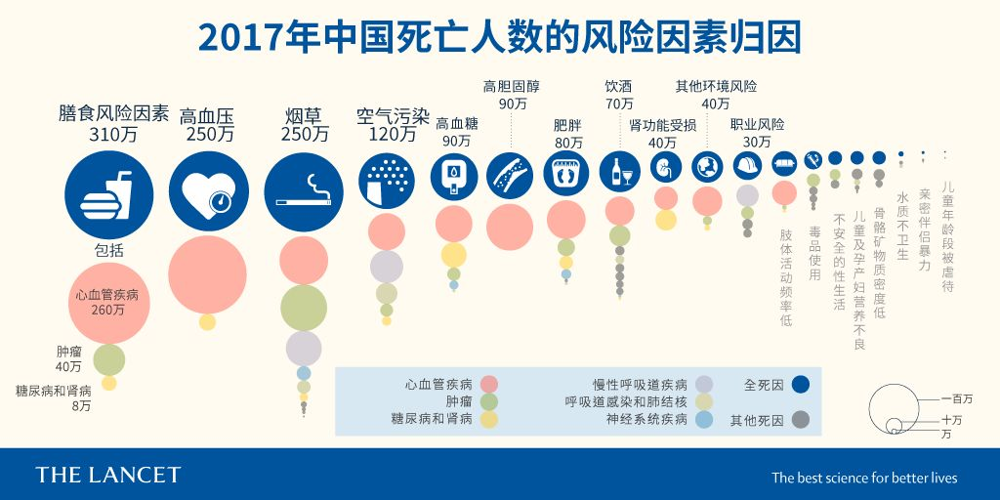

# 形势严峻，百害一利

## 一利——税收

《[烟草局：我国卷烟综合税负预计达 65.6%，高于目前世界平均水平](https://www.gov.cn/xinwen/2015-06/05/content_2873531.htm)》一文指出：

> 今年 5 月 10 日，我国再次提高卷烟消费税，卷烟批发环节从价税率由 5%提高到 11%，同时增加了 0.005 元/支的从量税。**此次提税后，预计今年（2015）我国卷烟综合税负将达到 65.6%**。
>
> 目前，我国烟草企业上缴国家财政的种类，主要包括税收和专项收益两大部分。
>
> 具体来讲，税收类包括七种：烟叶税、消费税、增值税、城市维护建设税、教育费附加、进口关税、企业所得税。
>
> 除了上面说到的七种税，烟草企业上缴国家财政的还有两种专项收益：国有资本收益和专项税后利润。

《[2022 年烟草行业实现税利总额和财政总额创历史新高](http://www.tobacco.gov.cn/gjyc/czxx/202303/e24d5fd1b221482d9d9c4910e481dbb4.shtml)》一文指出：

> 2022 年烟草行业实现工商税利总额 14413 亿元，同比增长 6.12%，实现财政总额 14416 亿元，同比增长 15.86%，实现税利总额和财政总额创历史新高，坚决落实并圆满完成中央关于特定专营机构上缴近年结存利润任务，为稳定经济大盘、保证国家和地方财政增收、促进经济社会发展作出积极贡献。

依据《[2022 年财政收支情况](http://www.gov.cn/xinwen/2023-01/31/content_5739311.htm)》，全国税收收入 166614 亿元，计算可知，烟草贡献了总税收的 8.65%。

[2023 年烟草行业实现税利总额和财政总额创历史新高](http://www.tobacco.gov.cn/gjyc/hyyw/202403/6e335f9ff79b4b9182c72da62ae4af26.shtml) 陈述：

> 2023 年烟草行业实现工商税利总额 15217 亿元，同比增长 5.6%，实现财政总额 15028 亿元，同比增长 4.3%，实现税利总额和财政总额创历史新高，为稳定经济大盘、保证国家和地方财政增收、促进经济社会发展作出积极贡献。

更多历年数据的可视化可以看 [数据分析：2008-2023 年我国烟草行业工商税利及财政贡献！](https://mp.weixin.qq.com/s/Be42O7GYE24rhe85fNRMkA)

但是这样还不够。《[世界卫生组织烟草税政策和管理技术手册](https://www.who.int/zh/publications/i/item/9789240019188)》指出：

> 政府应采取全面的烟草控制战略，其中包括减少成人烟草使用和预防青少年吸烟的目标。大幅提高消费税率是减少消费的最有效也是最具成本效益的措施。当与其他减少需求干预措施相结合时，增加税收对烟草使用的影响甚至更大。这些干预措施包括所有公共场所的全面无烟政策，全面禁止烟草广告、烟草公司的促销和赞助，关于烟草使用后果的大型图形健康警告，无装饰包装，帮助当前使用者戒烟的广泛努力和大众媒体公共教育活动。实施减少烟草使用的综合战略可进一步减少烟草使用的有害后果，为提高税收建立公众和政治支持，并最大限度地提高税收在实现公共卫生目标方面的有效性。

期待税率干到 100% 以上的一天，当然了，如果这一天无需到来（即烟草彻底禁售），就更好了！

## 百害

### 损害中国的国际形象

我国政府于 2005 年 8 月 28 日通过的《[全国人民代表大会常务委员会关于批准世界卫生组织《烟草控制框架公约》的决定](https://www.gov.cn/gongbao/content/2005/content_77784.htm)》内容如下：

> 第十届全国人民代表大会常务委员会第十七次会议决定：批准于 2003 年 5 月 21 日经第 56 届世界卫生大会通过的世界卫生组织《[烟草控制框架公约](https://apps.who.int/iris/bitstream/handle/10665/42811/9789245591016_chi.pdf)》；同时声明：根据世界卫生组织《烟草控制框架公约》第十六条第五款的规定，在中华人民共和国领域内禁止使用自动售烟机。

而根据 [2023 年全球烟草业干扰指数](https://globaltobaccoindex.org/report-summary)（越低越好），我国的指数高达 73（右上角紫色）：

高于我们的国家并不多，有意大利、马来西亚、美国、日本等。

而在「Key Findings」一节，还提到：

> **Embassies of five countries endorsed or promoted the tobacco industry**. Diplomatic missions of five countries, **China**, Germany, Italy, Japan and the U.K., were persuaded to promote the tobacco industry in other countries.
>
> 五国大使馆支持或推动了烟草行业。**中国**、德国、意大利、日本和英国的外交使团被说服在其他国家推广烟草行业。

如果 [下载全文](https://globaltobaccoindex.org/download/1728)，还有以下更细致的图表：

- 烟草业干预政策制定（Tobacco industry interferes in policy development）方面，中国的得分高达 20，世界第一！
- 政府与烟草业的非必要互动（Governments engage in unnecessary interaction with the tobacco industry）方面，中国的得分为 13，处于倒数第二梯队。
- 缺乏透明度（Lack of transparency）方面，中国的得分为 6，难得靠前一次。
- 利益冲突问题持续存在（Conflict of interest problem persists）方面，中国的得分为 8，处于中间靠后的位置。
- 政府采取预防措施保护自身（Governments that acted to protect themselves with preventive measures）方面，中国的得分为 13，靠前。
- 从 2021 年到 2023 年，中国的得分减少了 3，属于有进步但不大的一类，进步最快的乌克兰减少了 20 分。

另外，《[2023 年世卫组织全球烟草流行报告：保护人们免受烟草烟雾危害：执行概要](https://www.who.int/zh/publications/i/item/9789240077485)》总结道：

> 现已有四个国家（巴西、土耳其、毛里求斯、荷兰）做到以最佳实践水平实施整套 MPOWER 一揽子措施，另有八个国家（埃塞俄比亚、伊朗伊斯兰共和国、爱尔兰、约旦、马达加斯加、墨西哥、新西兰和西班牙）距离实施整套 MPOWER 一揽子措施仅有一步之遥。

M 指「监测烟草使用与预防政策」，P 指「保护人们免受烟草烟雾危害」，O 指「提供戒烟帮助」，W 指「警示烟草危害」，E 指「确保禁止烟草广告、促销和赞助」，R 指「提高烟税」。上述 12 个国家中没有中国。

如果你同意 [美国各种退群行为](https://m.thepaper.cn/baijiahao_11896996) 是一种耻辱，那么同理，中国无法在有利于「人类命运共同体」实现的公约方面做到排头兵也是一种耻辱。

### 经济损失

[Tobacco Atlas](https://tobaccoatlas.org/factsheets/china/) 指出，中国每年因烟草造成的经济损失高达 22026.7 亿元，**高于烟草行业的工商税利总额**。

[中国居民归因于吸烟的疾病直接经济负担分析](http://manu58.magtech.com.cn/zgyytj/CN/10.3969/j.issn.1006-5253.2021.03.012) 指出：

> **中国归因于吸烟的直接经济负担增长迅速**：2018 年归因于吸烟的直接经济负担为 826.3 亿元，相比 2008 的 428.0 亿元增加了 93.0%，年均增长 6.8%。在直接经济负担中，因门诊、住院、购药等治疗费用的占比为 92.7%，达到 766.2 亿元。一方面，同 2008 年相比，我国居民吸烟率无明显下降；另一方面，随着经济发展和医疗技术水平提高，医疗费用上升，导致因吸烟所致的患病率提高，次均医疗费用增加，加重了归因于疾病的直接经济负担。此外，随着我国人口规模和老龄化叠加效应，恶性肿瘤和心血管疾病的增长，带病生存年时间的延长，也会导致我国归因于吸烟的疾病经济负担上升。

研究也承认其存在低估经济负担的局限性。

《[中国无法承受的代价：烟草流行给中国造成的健康、经济和社会损失](https://iris.who.int/handle/10665/255473)》描述：

> 烟草使用导致的直接损失包括治疗呼吸道疾病、心血管疾病和癌症等吸烟相关疾病的医疗卫生支出。医疗卫生费用包括住院、门诊和自我服药的费用，既包括政府通过医保支付的部分，也包括个人自付部分。
>
> 2014 年，烟草使用给中国造成的直接和间接损失合计的总经济损失高达 3500 亿元。

### 劳动力损失

《中国吸烟危害健康报告 2020》编写组编写的[《中国吸烟危害健康报告 2020》概要](https://qikan.cqvip.com/Qikan/Article/Detail?id=7105889747) 中指出：2018 年，15 岁以上人口吸烟是总体比例是 26.6%，在男性中是 50.5%，女性中是 2.1%。

> 在吸烟者的定义为：1984 年：过去吸烟时间大于 6 个月且在调查时仍在吸烟者，调查对象为 ≥15 岁人群；1996 年和 2002 年：过去吸烟达到 100 支且在调查前 30 天内吸烟者，调查对象为 15~69 岁人群；2010 年、2015 年和 2018 年：调查时正在吸烟者，调查对象为 ≥15 岁人群。

[Tobacco Atlas](https://tobaccoatlas.org/factsheets/china/) 指出，2022 年 15 岁以上人口吸烟的总体比例为 24.9%，在男性中是 47.3%，女性中是 2%。中国每年因吸烟而死的人口高达 266.7 万人。

这同联合国观察到的趋势——[尽管烟草业竭力阻挠，但吸烟率继续下降](https://www.who.int/zh/news/item/16-01-2024-tobacco-use-declines-despite-tobacco-industry-efforts-to-jeopardize-progress)——相符。尽管总体比例在下降，但乘上中国庞大的人口基数，足以造成严重的后果。不仅如此，根据概要的「世界主要烟草消费国的人均烟草消费量变化趋势」图，中国是少数人均烟草消费量增长的国家之一，但遗憾的是该图的数据统计到 2015 年就截止了。

《柳叶刀》论文 [Mortality, morbidity, and risk factors in China and its provinces, 1990–2017: a systematic analysis for the Global Burden of Disease Study 2017](<https://www.thelancet.com/journals/lancet/article/PIIS0140-6736(19)30427-1/fulltext>)（1990-2017 年中国及其各省份死亡率、发病率和危险因素：2017 年全球疾病负担系统分析）指出，2017 年，烟草是同高血压并列第二的死亡风险因素，而且能够引发多种不同的疾病：

并且，2017 年，吸烟已经成为伤残调整损失寿命年的头号原因。更多信息可以参见[《柳叶刀》重磅！这是当今中国最严重的 4 大死亡风险因素 ](https://www.sohu.com/a/323166155_183834)。

### 间接损失

《[中国无法承受的代价：烟草流行给中国造成的健康、经济和社会损失](https://iris.who.int/handle/10665/255473)》描述：

> 间接损失包括烟草相关疾病有关的费用，如，交通费、营养费、住院期间和门诊看病时的看护费、以及烟草相关疾病造成的生产力损失等。间接经济损失还包括吸烟相关疾病导致过早死亡带来的损失。
>
> 如不大幅降低吸烟率，随着烟草相关疾病不断增加，这些损失未来可能呈指数级增长。
>
> 如报告所述，吸烟给中国造成了巨大的经济损失。非常值得注意的是，由于以下几个原因，这一损失很可能会被低估。
>
> 首先，模型研究仅包括三大主要吸烟相关疾病造成的损失：癌症、心血管疾病和呼吸道疾病。吸烟还会增加其他许多疾病的风险，包括牙科疾病、生殖系统问题和勃起功能障碍、溃疡、眼科和视力问题等。如果将这些疾病也包括在模型中，则损失值还会更大。
>
> 其次，由于在方法上难以将二手烟暴露所致死亡和疾病造成的经济损失纳入当前模型，因此本模型未将上述损失包括在内。如第 1 章所述，二手烟是中国的一个大问题，每年约导致 10 万人死亡和更多的患病和住院。将二手烟造成的经济损失包括在内，将使烟草使用导致的经济总损失增加：鉴于除吸烟每年造成 100 万人死亡外，二手烟暴露每年导致约 10 万人死亡，可以假设二手烟暴露导致的经济损失约占经济总损失的 10% 左右，这样总损失约为人民币 3850 万元。
>
> 第三，本模型所用的中国的死亡相对危险度或危险比（RR）低于印度等其他国家，明显低于美国。RR 值越高，归因于吸烟的比例（可归因于烟草的疾病比例）越大，相关的损失也越大。如果未来中国的研究显示死亡危险比与其他国家相一致，则采用本报告所用模型或类似模型估算出的损失值将会更高。
>
> 第四，值得注意的是，根据 2014 年全国卫生服务调查的数据，17%的中国公民报告上一年中应住院而未住院。这些数据提示，这组人群中可能就有罹患归因于吸烟的疾病、但未使用医疗服务的人。如果将未予满足的医疗服务需求转化为真正的需求，经济损失的数值可能会更大。
>
> 最后，本报告的模型分析未考虑照看吸烟相关疾病患者的亲戚或非正式看护者的缺勤天数。此外，由于缺乏缺勤数据，住院天数以外的吸烟导致残疾造成的生产力损失也未被考虑进去。因此，归因于吸烟的疾病所导致的实际间接发病成本可能远高于上述估计的数字。

### 加剧贫困和不公平

《[中国无法承受的代价：烟草流行给中国造成的健康、经济和社会损失](https://iris.who.int/handle/10665/255473)》描述：

> 除了烟草使用的宏观经济影响外，吸烟相关疾病和死亡、尤其是过早死亡，还会以各种方式伤害家庭，特别是低收入家庭，而烟草相关疾病和死亡对后者的经济影响要大得多。
>
> 治疗癌症等病的自付费用对许多家庭可能是灾难性的，即，医疗支出让家庭沦于贫困线之下。
>
> 烟草使用及相关疾病和死亡加剧了中国现有的不平等，包括在获得卫生服务方面和更广义的收入不平等。

[灾难性卫生支出：中国吸烟家庭与不吸烟家庭比较分析](https://heoagroup.org/2021/05/29/research-6/) 总结：

> 曾吸烟家庭两年灾难性卫生支出的发生率为 17.41% 和 20.03%，现吸烟家庭为 12.10% 和 15.09%，不吸烟家庭为 12.72% 和 13.64%。Logit 回归模型结果显示，曾吸烟家庭比不吸烟家庭更容易发生灾难性卫生支出。

### 威胁祖国花朵

《[烟草和尼古丁业的花招使青少年终身上瘾](https://www.who.int/zh/news/item/23-05-2024-tobacco-and-nicotine-industry-tactics-addict-youth-for-life)》一文指出：

> 「历史正在重演，因为烟草业试图以不同的包装向我们的儿童出售相同的尼古丁，」世卫组织总干事谭德塞博士说。「这些行业积极针对学校，儿童和年轻人。它们的新产品基本上就是糖果味的陷阱。在向儿童推销这些高度致瘾的危险产品时，他们怎么能谈论减少伤害呢？」
>
> 这些行业继续向年轻人推销糖果和水果等诱人口味的产品。美国的一项研究发现，如果产品只有烟草味，超过 70% 的青少年电子烟使用者会戒烟。
>
> 世卫组织健康促进司司长 Ruediger Krech 博士说：「这些行业有意设计直接吸引儿童的产品和采用直接吸引儿童的营销策略。使用儿童喜欢的口味，如棉花糖和泡泡糖味，结合类似于玩具的光滑多彩设计，这是在公然诱惑年轻人对这些有害产品上瘾。」

[《中国吸烟危害健康报告 2020》概要](https://qikan.cqvip.com/Qikan/Article/Detail?id=7105889747) 陈明：

> 电子烟自上市后在全球迅速流行，我国电子烟的使用率为 0.9%，电子烟使用者约为 1035 万。
>
> 使用电子烟可能致人更容易使用卷烟，这一现象在青少年中尤为明显。一项包含 91051 例青少年受试者的 Meta 分析研究结果显示，青少年使用电子烟后成为卷烟使用者的风险是从不使用电子烟者的 2.21 倍。电子烟除了会吸引青少年使用卷烟外，本身亦对青少年的身心健康和成长造成不良影响。2016 年《美国卫生总监报告》中关于青少年电子烟使用的报告显示，电子烟中的尼古丁会影响青少年的大脑发育，青春期使用会对青少年的注意力、学习、情绪波动和冲动控制产生影响。

**综上所述，哪怕是做有利于烟草业的比大小游戏，其所交的税，也抵消不了它造的孽。更遑论它带来了如此多经济以外全方位的恶果，这不是善法良治应导向的结果。**
