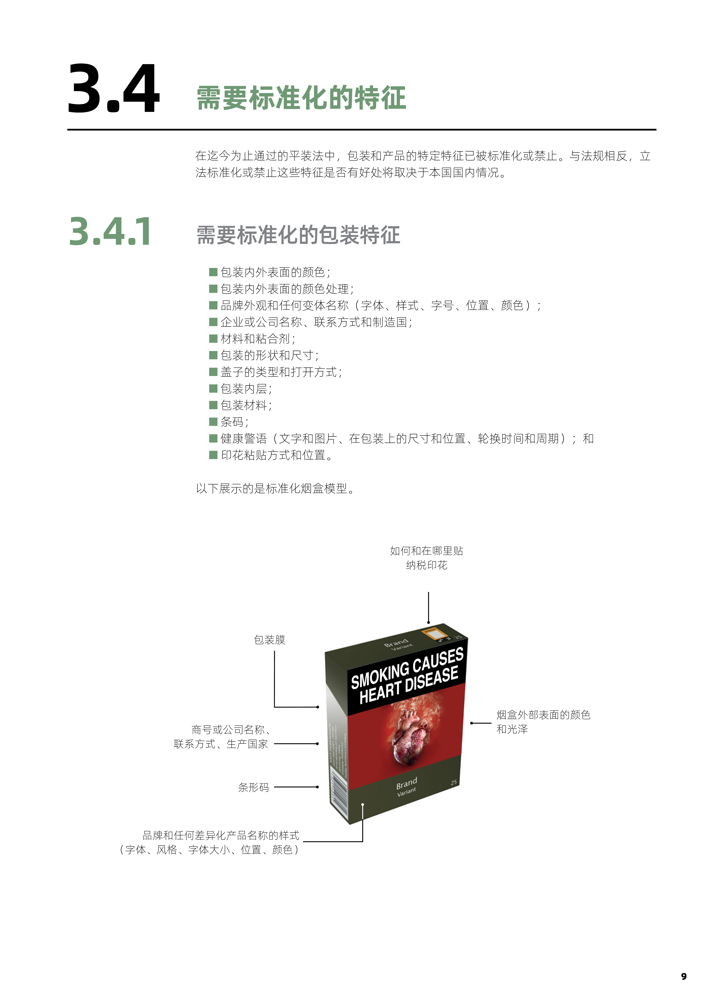
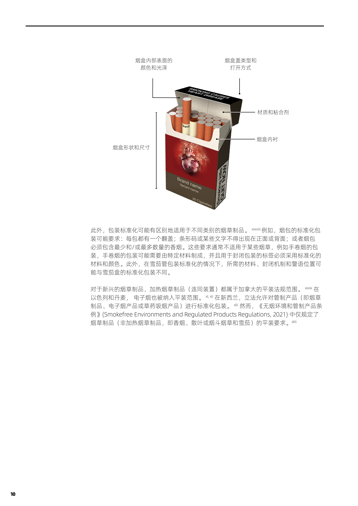

# 烟草平装，难以推进

世卫组织的 [烟草平装](https://www.who.int/zh/publications/i/item/9789240051607) 介绍：

> 平装（或标准化包装）的定义为「除以标准颜色和字体显示品牌名称和产品名称外，限制或禁止在包装上使用其他标识、颜色、品牌形象或推销文字的措施」。平装的目的在于：
>
> 1. 减弱烟草制品的吸引力；
> 2. 消除广告和促销形式的烟草包装；
> 3. 通过处理可能表明某些产品比其他产品危害小的包装设计技巧来消除误导性信息；和
> 4. 增强健康警语的显著性和有效性。
>
> 这些目的能够减少对烟草制品的需求，进而有助于实现保护健康这一更广泛目标。
>
> 在全面控烟进程中，建议实行平装，包括印贴大幅图形健康警语，并全面禁止烟草广告、促销和赞助行为。尽管平装本身无法解决烟草流行问题，但如 WHO FCTC 中所提议，应将其作为全面控烟战略的一部分予以实行。

央视网的 [什么是烟草制品的平装？](https://jiankang.cctv.com/2016/05/29/ARTIEPo7nDVSmKmdzZ5DEA8P160529.shtml)提到，也有定义内容如下：

> 使用黑白两色或国家当局规定的其他两种反差颜色；包装上只有品牌名称、产品名称和/或制造商的名称、联系方式和制品数量，除健康警示、纳税印花和其他政府授权的信息或标记外，没有任何标识或其他特点；使用规定的字体和尺寸；以及标准形状、尺寸和材料。烟盒内或烟盒上亦或单支卷烟或其他烟草制品上不应含有任何广告或促销信息。

## 国外实施进展

[烟草平装](https://www.who.int/zh/publications/i/item/9789240051607) 中有相关表格，予以汇总如下：

| 国家       | 全面实施平装法规的日期 |
| ---------- | ---------------------- |
| 澳大利亚   | 2012 年 12 月 1 日     |
| 法国       | 2017 年 1 月 1 日      |
| 英国       | 2017 年 5 月 20 日     |
| 新西兰     | 2018 年 6 月 6 日      |
| 挪威       | 2018 年 7 月 1 日      |
| 爱尔兰     | 2018 年 9 月 30 日     |
| 匈牙利     | 2019 年 5 月 20 日     |
| 泰国       | 2019 年 12 月 8 日     |
| 乌拉圭     | 2019 年 12 月 21 日    |
| 沙特阿拉伯 | 2020 年 1 月 1 日      |
| 斯洛文尼亚 | 2020 年 1 月 1 日      |
| 土耳其     | 2020 年 1 月 5 日      |
| 比利时     | 2021 年 1 月 1 日      |
| 加拿大     | 2022 年 2 月 7 日      |
| 新加坡     | 2020 年 7 月 1 日      |
| 以色列     | 2020 年 1 月 8 日      |
| 荷兰       | 2021 年 10 月 1 日     |
| 丹麦       | 2022 年 10 月 1 日     |
| 缅甸       | 2022 年 4 月 10 日     |

这里面着重提到两个国家，一个是以色列，另一个是缅甸，这两个国家令我国在控烟的烟草平装方面应格外感到耻辱。

以色列是一个侵害巴勒斯坦人权的国家，他们漠视邻国居民的生命，却重视本国国民的健康。我国则奉行和平主义政策，尊重他国主权和领土完整，对外国人很有文明礼貌，然而对内却在一定程度上忽视居民健康。缅甸是一个各方各面跟着我国亦步亦趋的政权，然而在烟草平装方面却领先一步，这怎能不令人感到倒反天罡呢？

关于其他国家和地区，[读懂烟盒上的警示图，控烟，我们一起行动](http://www.cqlp.gov.cn/wsjkw/zwgk_29045/agwsyd/202411/t20241111_13786674.html) 一文也有介绍：

> 澳大利亚是世界上第一个实施标准化烟盒包装的国家，从 2012 年起，所有烟草制品都被要求使用橄榄绿色的包装，并且上面印有大幅的健康警示图像。据《烟草控制》杂志的一项研究显示，自实施新包装法以来，澳大利亚成年人的吸烟率从 2010 年的 15.1% 下降到 2016 年的 12.2%。
>
> 英国在 2016 年也开始实行类似的标准化包装，并且烟盒上至少 65%的面积必须用于健康警告。根据公共卫生英格兰的数据，自从引入标准化包装之后，英国的吸烟率持续下降，2019 年只有 13.9% 的成人吸烟，而在 2011 年时这一比例为 20.1%。
>
> 加拿大的烟盒警示图早在 2001 年就开始使用，并且随着时间的推移不断更新。例如，2019 年更新后的烟盒上增加了对孕妇和胎儿健康的警告。据加拿大卫生部的数据，吸烟率从 2001 年的 24% 降至 2017 年的 13%。
>
> 巴西在 2009 年引入了带有强烈图像的烟盒警示，这些图示旨在展示吸烟可能引发的健康问题，如口腔癌和心脏疾病。巴西卫生部报告称，自 2009 年以来，吸烟率从 2008 年的 18.1% 下降至 2019 年的 9.7%。
>
> 泰国也是一个在烟盒上使用强烈图像的国家。泰国卫生部门要求烟盒上的警示图像占据包装正面和背面的大部分面积，这些图像包括了因吸烟导致的各种疾病状态，如口腔癌、肺癌等。泰国的吸烟率也有所下降，根据泰国卫生部的数据，从 2011 年的 25.3% 下降至 2019 年的 21%。
>
> 新加坡在烟盒上使用了非常醒目的健康警示图像，这些图像占据了烟盒的大部分面积，并且包括了一系列令人震惊的画面，如被腐蚀的牙齿、烧焦的肺以及其他吸烟可能导致的健康问题。吸烟率从 1992 年的 18.3% 下降到了 2019 年的 10.6%。
>
> 新西兰从 2016 年开始响应世界卫生组织的呼吁，要求所有烟盒必须注明诸如「吸烟有害健康」的字样，并印满吸烟导致的各种疾病等极度不适的警示图片。吸烟率从 2016 年的 14.2% 下降到了 2022 年的 8%。
>
> 中国香港自 2006 年开始引入烟盒警示图像，并且随着时间的推移不断增加图像的尺寸和数量。目前，香港的烟盒警示图像占据包装正面和背面的 85% 以上。据香港卫生署的数据，吸烟率从 2006 年的 12.9% 下降至现在 9.1%。
>
> 中国澳门自 2008 年起实施了烟盒警示图像政策，并且在 2011 年进行了修订，增加了警示图像的数量和面积。目前，澳门的烟盒警示图像占据了包装正面和背面的 75%。根据澳门卫生局的数据，吸烟率从 2009 年的 16.7% 下降至现在的 10.6%。

当然了，上述吸烟率的下降，原因必然不是单一的包装变化，肯定还有其他控烟措施协同推进的，但「烟盒上的那些『重口味』图片，不是恐怖片海报，是真人真事！」大面积的病灶示例图以及恶心丑陋的颜色，也确实能相当程度地消解一部分比较清醒的人的购买欲望，而且更重要的是，长相不再喜庆以后，就很难再出于赠与目的去购买了，这很重要。

### 标准化烟盒模型示例

### 部分国家烟盒示例

我国历来在各行各业都有力争第一的好习惯，可惜，在这个赛道上，最佳名次不会超过第 18。但是，在彻底禁绝烟草的赛道上，仍然有可能勇夺第一，不妨一试。

## 我国实施进展

[世卫组织:平装成全球趋势 呼吁出台全国无烟立法](https://jiankang.cctv.com/2016/05/30/ARTICRnsMIHcLCA5bbCNuaUU160530.shtml) 介绍：

> 今年（2016 年）世界无烟日的全球主题是为平装做好准备。「平装正迅速成为一种全球趋势。中国若能出台一部严格完善的全国无烟立法，并在其中规定使用图形健康警示，将可以抓住机遇，在引进平装的正确道路上更近一步。我们希望中国的立法者不要错失这个良机。」世界卫生组织驻华代表施贺德博士指出。

### 总体落后

[【深度】烟盒上的拉锯战：中国烟草制品平装还很遥远](https://www.jiemian.com/article/673598.html) 介绍：

> 「在所有的广告载体中，香烟盒却依然是最有效的宣传渠道。」法国里昂一大当代史教授迪迪埃・努里松在其著作《香烟的历史》中写道。
>
> 这也是为什么，烟盒成为烟草业和控烟界拉锯的「战场」之一。
>
> 与澳大利亚以及一些欧洲国家已经立法强制烟草平装化相比，中国还在围绕「烟盒」上演着拉锯战。
>
> 「别说平装，我们连图形警示上烟包都步履艰难。」无烟草青少年运动中国项目主任印曦接受界面新闻采访时说。
>
> 北京协和医科大学教授、原中国疾控中心副主任杨功焕认为，由中国国家烟草专卖局负责这项规定的执行，仅仅是几条不变的语句：吸烟有害健康，戒烟有益健康，**完全不符合《公约》的要求**。
>
> 据中国疾控中心提供的资料，我国在 2008 年 10 月以前，仅在烟盒侧面标注警示语：「吸烟有害健康」。2008 年 10 月之后，要求将文字警示移到了烟盒正面和背面，占据烟盒正面及背面 30%的面积。2012 年 4 月，又将警示字体放大，背面的英文改为中文，并增加了「戒烟可减少对健康的危害」以及「及早戒烟有益健康」两句话。
>
> 加拿大的一项研究发现，吸烟率在使用图形警示后的降低更为显著。本研究利用统计模型来比较加拿大使用图形警示九年前和九年后吸烟率的变化。从 2000 年至 2009 年，图形警示的使用使得加拿大的吸烟率降低了 12% 至 20%。加拿大吸烟率的显著的降低远远超过同期美国吸烟率的降低。
>
> 世卫组织官网报道，据澳大利亚癌症理事会烟草问题委员会主席 Kylie Lindorff 称，自从新法律生效后，澳大利亚辅助戒烟服务机构「戒烟热线」接到的电话数量大大增加。「很多烟民表示他们不喜欢新包装外观，而且觉得卷烟味道更差了，尽管烟草公司确定产品并无变化，」Lindorff 说，「这说明在引发对品牌质量和特色的猜想方面，包装起到很重要的作用。」
>
> 反观我国，今年是《公约》在我国正式生效十周年，回首中国控烟事业，多位控烟人士认为，**中国的控烟运动远远赶不上世界的形势，烟草制品平装目前实现起来更是遥远**。

### 两幅面孔

[新华网评禁烟：平装香烟推不下去国内部分烟草企业难辞其咎](https://www.thepaper.cn/newsDetail_forward_1476840) 中提到：

> 那为何平装香烟的理念在国内迟迟推广不下去呢？恐怕**国内部分烟草企业唯利益至上以及缺失的企业责任感难辞其咎**。很多香烟品牌不仅在国内市场销售，也出口海外，这本身并无可厚非。然而，个别品牌在两个市场搞两种包装，试图以「双重标准」牟取利益，一面为迎合国际审查标准，在出口的香烟上「大大方方」地印刷上醒目的警示语，一面在本土市场的包装上画画青山绿水、名胜古迹，营造美感，置企业责任与国民健康于不顾，又怎能不让国人「长太息以掩涕兮」？
>
> 除此之外，烟草企业也要积极转变发展理念，承担自身的社会责任。烟草是高税收产品，一直以垄断的专卖制度运行，而**政企合一的模式使得很多地方政府成为了烟草企业的「保护伞」，改革难以有效推进**。但**财政税收高并不能成为拒绝改革的「盾牌」，因为这与国民整体长期付出的健康成本相比微不足道**。因此，逐步推动烟草企业缩减产量，以高价代替高产，从供给侧改变烟草行业模式，已是势在必行。

[同样是中华香烟香烟包装风格却千差万别！](https://www.cnxiangyan.com/zhishi/10395.html) 介绍了「中华」牌卷烟在泰国、香港特别行政区、台湾省的包装，具体如下：

> 这款香烟包装略微显得有点过于恐怖，特别是患者图片，作为吸烟者看到这种包装，都会对这款香烟失去抽吸的兴趣，如果烟瘾来了，那就另当别论。所以说，虽然包装对于戒烟确实有些帮助，但不能起关键作用。

> 烟盒正面图片里，父母在吸烟，镜头前孩子捂住双嘴，图片下有黑色和红色的字写着「吸烟祸及家人」，烟盒背面是张病足照片，底部写着「吸烟引致末梢血管疾病」。

> 这款烟在 50% 的烟盒面积上，印有一支被点燃的烟变得弯曲的图案，写着「吸烟会导致性功能障碍」，这款烟无疑是直接针对男性所标志的告诫语。

而中华在中国大陆的包装就不用谈了，那简直太喜庆了，其他品牌也有同样的行为，确实是哥俩好。有趣吗？有趣。可悲吗？可悲。可耻吗？可耻！连台湾都比不过，脸都丢尽了！

### 开历史的倒车

[【深度】烟盒上的拉锯战：中国烟草制品平装还很遥远](https://www.jiemian.com/article/673598.html) 介绍：

> 5 月初，最新一版《上海市公共场所控制吸烟条例》修订草案向上海市人大代表和政协委员征求意见，草案在原先征求意见稿的基础上，增加了两段内容，即「旅馆客房应当设置专门的非吸烟住宿楼层或者客房，鼓励旅馆经营者将旅馆客房设立为全面禁止吸烟区域」，以及「机场、铁路客运站、港口客运站以及有条件的室内工作场所，可以设置具有独立通风系统且符合安全标准的吸烟室。」
>
> 此条款随即引起了广泛的争议，**控烟人士们认为这是立法控烟的倒退**。
>
> 「室内吸烟室完全不能减少烟草烟雾对公众的伤害。」复旦大学健康传播研究所控烟研究中心（以下简称「复旦控烟中心」）主任郑频频接受界面新闻采访时说。
>
> 今年 5 月，复旦控烟中心在上海主要的火车站和长途汽车客运站，研究中心采用室内 PM2.5 浓度测定和问卷调查法开展研究。5 月 29 日，复旦控烟中心发布了这份调查报告。
>
> 调查报告显示，**吸烟室内严重污染，吸烟室外也不能幸免**。
>
> 调查数据显示，吸烟室内、吸烟室外和吸烟室外 5 米的 PM2.5 浓度有显著差异，呈现出「吸烟室内>吸烟室门口>吸烟室外 5 米的情况>室外」的情况。吸烟室内部的 PM2.5 浓度值在 592-2535 微克/立方米之间，是目前我国标准 75 微克/立方米的 8 到 30 倍。
>
> 另外，吸烟室门口也是重灾区，本次测定浓度值在 197-909 微克/立方米之间，均达到污染甚至严重污染。**由于吸烟室内烟雾弥漫污染严重，吸烟者在门外吸烟普遍，个别吸烟室门口的浓度甚至高于吸烟室内浓度**。吸烟室外 5 米的浓度普遍高于室外浓度，最高可以达到室外浓度的 8 倍。
>
> 「讲到室外的空气污染，大家都觉得是非常重要的一个问题，但室内吸烟的严重程度比重度 PM2.5 污染还更严重，公众对此重视还不够，忽视是因为对室内烟霾危害的不知情，公众应有对自身健康的知情权和选择权。」复旦大学健康传播研究所所长傅华说，**目前国家已出台相关法律控制大气污染，但对于室内烟草导致的「烟霾」，还需要下更大力气进行治理**。
>
> 傅华强调，**降低室内烟草烟雾危害的核心，就是要在公共场所 100% 禁烟**。
>
> 对于中国控烟界来说，很多人都和傅华有同感。很多人注意到，全国性的《公共场所控烟条例》自 2014 年 11 月份开始征求意见后，目前已到出台前的「最后一公里」阶段。但这个条例非常有可能会给吸烟者留个「口子」，即允许在一些公共场所设置吸烟区。
>
> 这种违背国际的做法被很多人士认为是立法的倒退。

注：吸烟室相关豁免请见 [上海市公共场所控制吸烟条例](https://wsjkw.sh.gov.cn/sh1/20180525/0012-31558.html) 的第七条、第八条。

## 本协会在烟草平装方面的愿景

在全面禁绝烟草前，推动烟草平装成为强制性标准，尽可能杜绝其成为礼物的可能性。

与诸君共勉！
